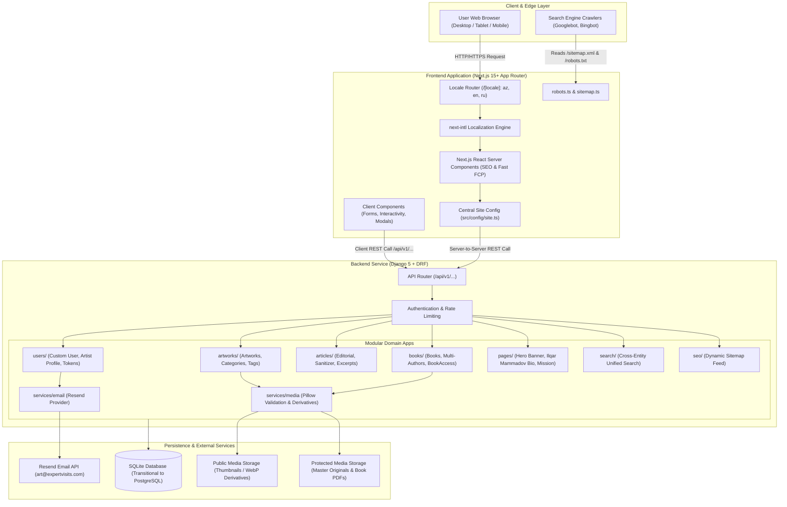
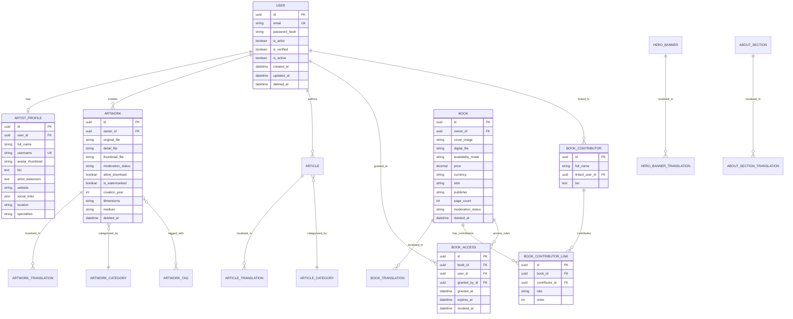
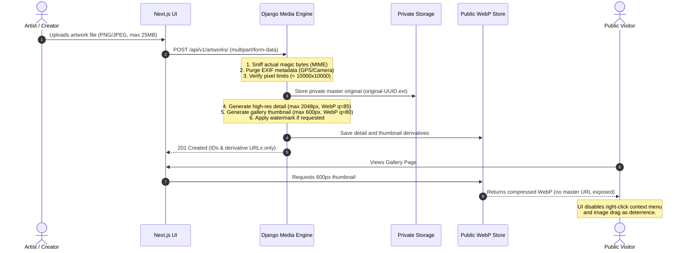
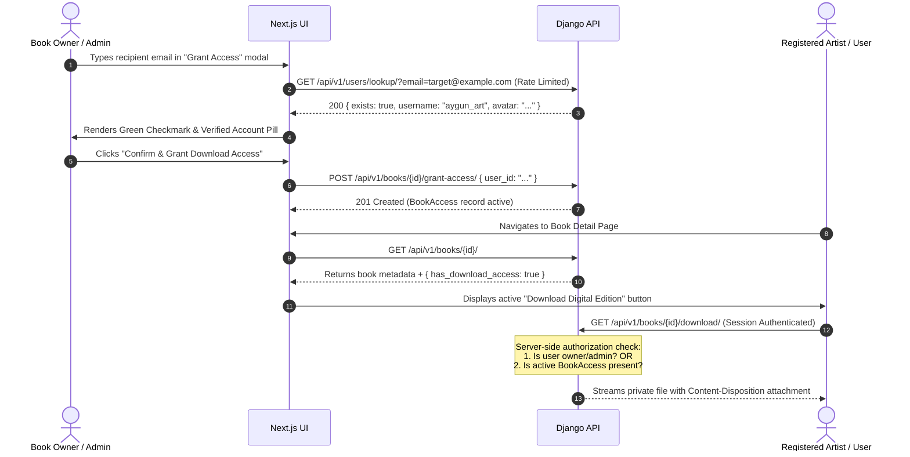

# System Architecture & Technical Specifications

This document outlines the architectural blueprint, security perimeter, data relationships, and deployment topology of the **Ilqar Mammadov Art Platform & Creator Publishing Ecosystem**.

---

## 1. High-Level Architecture

The platform operates as a decoupled **Modular Monolith + REST API** paired with a **Next.js App Router** server-rendered frontend.



---

## 2. Domain Data Model & Entity Relationships



---

## 3. Media Processing Pipeline & Security Model



---

## 4. Book Granular Access Verification Sequence



---

## 5. Directory Structure Convention

### Backend Architecture
```text
backend/
├── config/                  # Root project settings, urls, wsgi, asgi
│   ├── settings.py          # Derives SITE_URL, BACKEND_URL, RESEND keys from env
│   └── urls.py              # Root API routing (/api/v1/...)
├── core/                    # Core infrastructural code
│   ├── models/              # TimestampedModel, SoftDeletableModel
│   ├── permissions/         # IsAdminOrOwner, IsApprovedOrOwner
│   ├── pagination.py        # Standard pagination classes
│   └── exceptions.py        # Uniform API exception format
├── users/                   # Authentication & profile domain
│   ├── models/              # Custom User, ArtistProfile, EmailVerificationToken
│   ├── services/            # RegistrationService, TokenService, EmailService
│   └── api/                 # Serializers, Views, URLs
├── artworks/                # Artworks domain
│   ├── models/              # Artwork, ArtworkCategory, ArtworkTranslation
│   ├── services/            # ArtworkMediaService (Pillow resizing/watermarking)
│   └── api/
├── articles/                # Editorial publishing domain
│   ├── models/              # Article, ArticleCategory, ArticleTranslation
│   ├── services/            # ArticleService (sanitization, reading time)
│   └── api/
├── books/                   # Digital book publishing & access control
│   ├── models/              # Book, BookTranslation, BookContributor, BookAccess
│   ├── services/            # BookAccessService, BookMediaService
│   └── api/
├── pages/                   # Editorial and home content
│   ├── models/              # HeroBanner, AboutContent, SiteSettings
│   └── api/
├── search/                  # Cross-domain search
│   └── selectors/           # SearchSelector aggregating models
└── seo/                     # Dynamic sitemap & SEO
    └── api/                 # SitemapView returning valid URLs with hreflang
```

### Frontend Architecture
```text
frontend/
├── messages/                # Strict static internationalization catalogs
│   ├── az.json              # Azerbaijani (Default)
│   ├── en.json              # English
│   └── ru.json              # Russian
├── src/
│   ├── config/
│   │   └── site.ts          # Centralized domain and environment configuration
│   ├── i18n/
│   │   ├── request.ts       # next-intl server configuration
│   │   └── routing.ts       # Supported locales and path prefixes
│   ├── app/
│   │   └── [locale]/        # Localized App Router tree
│   │       ├── layout.tsx   # Root layout with fonts, metadata, Navbar, Footer
│   │       ├── page.tsx     # Homepage (Hero, Archive, Artworks, Books, Articles)
│   │       ├── about/       # Ilqar Mammadov Biography & Platform Mission
│   │       ├── artworks/    # Gallery & Detail pages
│   │       ├── books/       # Books catalog & Detail with Access controls
│   │       ├── articles/    # Editorial blog & Article Detail
│   │       ├── artists/     # Artist directory & Public portfolios
│   │       ├── publish/     # Content submission (Artwork, Article, Book)
│   │       ├── profile/     # Artist dashboard & content management
│   │       ├── login/       # Authentication
│   │       └── register/    # Verification code flow
│   ├── components/
│   │   ├── ui/              # Buttons, inputs, modals, badges, cards
│   │   ├── layout/          # Navbar, Footer, LanguageSwitcher, MobileMenu
│   │   └── shared/          # ImageProtectionWrapper, JsonLd, Pagination
│   ├── features/            # Feature-encapsulated logic
│   │   ├── auth/            # AuthContext, hooks, login/register forms
│   │   ├── artworks/        # Gallery components, filters, artwork card
│   │   ├── books/           # Book card, AccessGrantModal, reader
│   │   ├── articles/        # Article card, markdown renderer, social share
│   │   └── publishing/      # Multilingual submission forms with review warning
│   └── lib/
│       ├── api/             # Unified fetch client with CSRF & session handling
│       └── seo/             # Structured data generators (JSON-LD)
```
